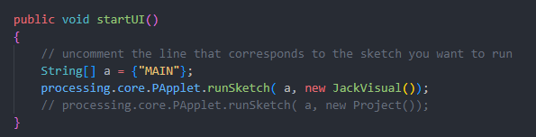

# Music Visualiser Project

Name:
	Jack Doyle
	Stephen Hughes
	Michael Farrell

Student Number: 
	C17315223	(Jack)
	D21126653	(Stephen)
	D21126674	(Michael)

## Instructions
- Fork this repository and use it a starter project for your assignment
- Create a new package named your student number and put all your code in this package.
- You should start by creating a subclass of ie.tudublin.Visual
- There is an example visualiser called MyVisual in the example package
- Check out the WaveForm and AudioBandsVisual for examples of how to call the Processing functions from other classes that are not subclasses of PApplet

# Description of the assignment
In our assignment we decided that it would be best for us to work on our own individual visuals using Processing. The general theme throughout each visual is that they are all connecting to the amplitude / Frequencies of the music causing it to pulse, spin etc. The music is also interacting with the lighting and colours of the drawings. The main visual is a combination of our work and will be the one included in the video.

# Instructions
In our project we decided that it would be best to label the file as our names and have each class separate for the purposes of editing code.
We intended to have a switch statement that allowed us to switch between each visual as well as display the main combined visual, but this proved difficult due to the differing formats of people's code.

Our solution was to have two PApplet sketch objects that run in main, and must be changed to run the two sketches. This is shown in the below image, where JackVisual is the main visual and Project is the individual parts.


Once the correct sketch is selected, just run the main function and it should work. If the project sketch is selected, the number keys should be used to select the different visuals (the main visual is selected by default).

# How it works
**Stephen**  
My file starts with the middle of the screen being the diamond that I drew using vertex mapping while setting the shape to have getSmoothAmplitude. The diamond shape will pulsate to music.

I then introduced a tunnel effect drawing lines to the center of the shape; however, by adding the diamond value from the previous section it was connecting to the edges of the diamond, causing the lines to also decrease and expand to the amplitude of the song.

I introduced a rotating cube to add some dimension to the shape and also to give the cube surrounding the diamond shape - this was achieved using box and boxsize.

Finally, I had a border effect that was similar to the waveform, but instead I had it expand from the top and bottom of the screen using height and width.

**Michael**  
For my visual in the group assignment, I wanted to make something trippy and hypnotic as our song of choice had that fitting beat for it. I started with creating 4 circles of various sizes inside one another that change random colours and pulses along to the beat as that was the easier part to implement. Next, I placed a spinning spiral of various hue colouring in the centre of the screen that rotated and expanded at an angle, as the amplitude of the song increases the size of the spiral increases alongside it, peaking when the base drops hopefully putting the user witnessing it in a trans like state. 

**Jack**  
For My part I planned on making the background portion of the visual, and wanted something kind of trippy that reacted well to different frequencies of the music, so as to get a good visual of the entire song.
I created a separate class file Wall.java to create the moving boxes on the walls that would speed up or slow down based on the presence of the higher frequency bands.
I then created an array of wall objects in the main JackVisual file and used for loops to create a moving tunnel effect by creating 400 of the wall objects.
The other element i created was the spotlight effect. These react to the amplitude of the music rather than a specific frequency. They are drawn in the main JackVisual class using a number of lines offset on the z axis whose x and y values are offset using the ```getAmplitude()``` as well as a variable that increases the offset as the z offset increases.


# What I am most proud of in the assignment

**Stephen**  
The diamond shape in the centre is what I am most proud of with the amplitude of it making it pulse to the song - the lines "tunnel" connecting the the diamond shape also interacts with parts of the code in diamond to have the connecting lines expand and shrink to the amplitude in conjunction with the diamond shape. In my final render I also have a border which is similar to the waveform, however I made it expand from the top and bottom of the screen again, to the amplitude of the song

-- Shape of diamond being mapped out the vertex and including height and width --

	
	z.beginShape();
	z.vertex(z.width / 2, z.height / 2 + diamond *2);
	//vertex(width / 2 + 10, height / 2 + 10);
	z.vertex(z.width / 2 + diamond, z.height / 2 );
	// vertex(width / 2 + 10, height / 2  - 10);
	z.vertex(z.width / 2, z.height /2 - diamond*2);
	//vertex(width / 2 - 10, height / 2 - 10);
	z.vertex(z.width / 2 - diamond , z.height / 2 );
	z.vertex(z.width /2, z.height /2 + diamond*2);
	//vertex(width /2 - 10, height /2 + 10);
	z.endShape();
	z.beginShape();


-- Tunnel connecting to middle diamond shape with it touching the edges of the diamond to expand and shrink --

	```Java
	z.beginShape();
	float diamond = 10 + (200 * z.getSmoothedAmplitude()); 
	z.stroke(z.random(0,255),255,255);
	z.strokeWeight(3);
	z.line(0, 0, z.width / 2 - diamond, z.height / 2 - diamond);
	z.line(0, 800, z.width / 2 - diamond, z.height / 2 + diamond);
	z.line(800, 800, z.width / 2 + diamond, z.height / 2 + diamond);
	z.line(800, 0, z.width / 2 + diamond, z.height / 2 - diamond);
	z.endShape();
	```

**Michael**  
The part of my visual I am most proud of is the spinning spiral of various hue changing coloring that that rotates and expands at an angle along with the amplitude. It took many hours of watching various tutorials to implement and countless hours of tweaking values to have it presented in the way I wanted. I am also proud of us as a group working together to combine our visuals together for the final combination visual.

**Jack**  
The part I am most proud of is the spotlights. I originally wanted them to work like the waveform example provided, but while messing around with values ended up looking like a large triangle, giving the spotlight effect. After some more tinkering I ended up with the end result and was very happy with how it looked, given that it was a happy accident!
The walls also took me a long time to get working and figuring out the for loop sequence and frequencies I needed was an arduous process.


**Combined**  
What we as a team are most proud of is the work put in together to combine our separate visuals and change values as we went to represent different frequencies using the different elements of the visual. The diamond and circles in the center represent the base, the walls represent the high frequencies, the cube rotates based on vocals, and the cube size and spotlight size are just based on the amplitude.  
We are very happy with how the assignment turned out in the end and learned a lot about java and processing during the course of the project.

# Markdown Tutorial

This is *emphasis*

This is a bulleted list

- Item
- Item

This is a numbered list

1. Item
1. Item

This is a [hyperlink](http://bryanduggan.org)

# Headings
## Headings
#### Headings
##### Headings

This is code:

```Java
public void render()
{
	ui.noFill();
	ui.stroke(255);
	ui.rect(x, y, width, height);
	ui.textAlign(PApplet.CENTER, PApplet.CENTER);
	ui.text(text, x + width * 0.5f, y + height * 0.5f);
}
```

So is this without specifying the language:

```
public void render()
{
	ui.noFill();
	ui.stroke(255);
	ui.rect(x, y, width, height);
	ui.textAlign(PApplet.CENTER, PApplet.CENTER);
	ui.text(text, x + width * 0.5f, y + height * 0.5f);
}
```

This is an image using a relative URL:


This is an image using an absolute URL:


This is a youtube video:

[](https://www.youtube.com/watch?v=J2kHSSFA4NU)

This is a table:

| Heading 1 | Heading 2 |
|-----------|-----------|
|Some stuff | Some more stuff in this column |
|Some stuff | Some more stuff in this column |
|Some stuff | Some more stuff in this column |
|Some stuff | Some more stuff in this column |

